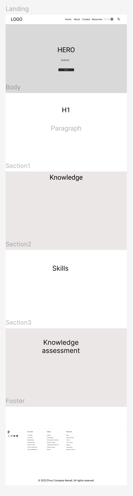
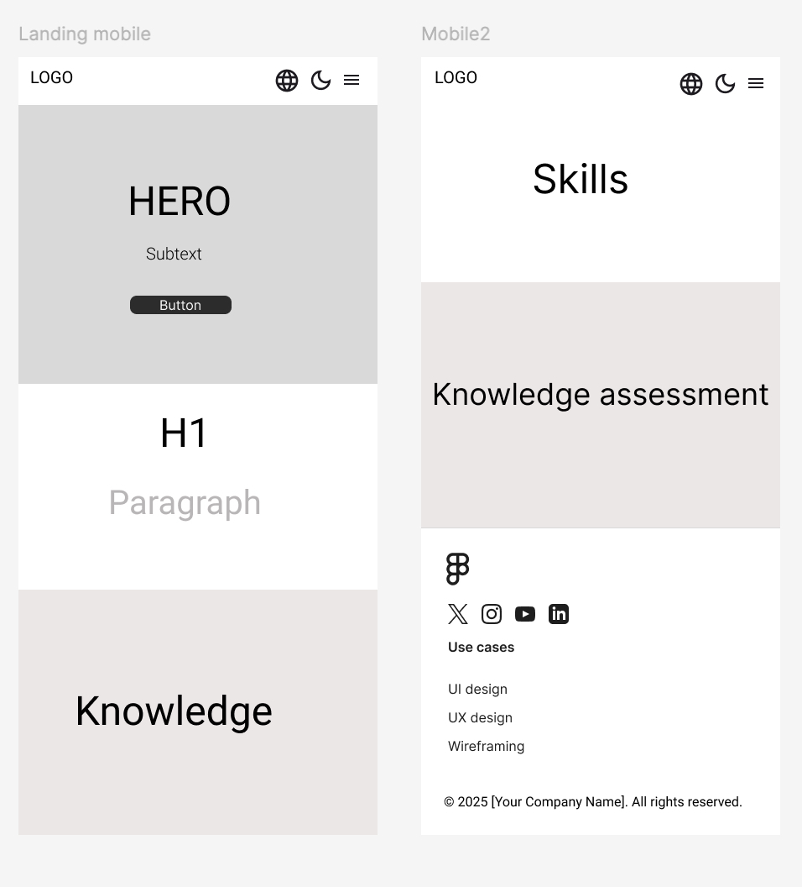
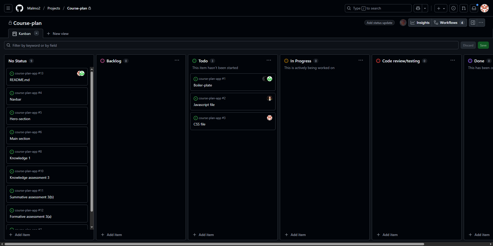

# Course-plan

## Design 

### Desktop

### Mobile

## Project Backlog and Overview

This document outlines the current backlog for the project.  
The backlog will **constantly change and be updated** as development progresses.

---

### Current backlog will constantly change and be updated.

| Feature | Description | Priority | Milestone | Status |
| -------- | ------------ | -------- | ---------- | ------- |
| **Boilerplate** | Simple HTML boilerplate for the base structure of the project | High | MVP | Todo |
| **JS File** | Main JavaScript file to handle interactivity and functionality | High | MVP | Todo |
| **CSS File** | Main CSS stylesheet for layout and design | High | MVP | Todo |
| **Navbar** | Navigation menu with links to main sections | Moderate | MVP | Todo |
| **Hero Section** | Introduction area with pitch and call-to-action | High | MVP | Todo |
| **Main Section** | Primary content area of the page | Moderate | MVP | Todo |
| **Footer** | Footer containing additional information and links | Moderate | MVP | Todo |
| **Knowledge** | Defines knowledge requirements for the course | Moderate | MVP | Todo |
| **Skills** | Defines skill requirements for the course | Moderate | MVP | Todo |
| **Knowledge Assessment** | Overall evaluation of course knowledge | Moderate | MVP | Todo |
| **Summative Assessment** | Retroactive and written tests to assess learning outcomes | Moderate | MVP | Todo |
| **Formative Assessment** | Continuous evaluation of students' knowledge and skills during interactive course activities | Moderate | MVP | Todo |
| **README.md** | Project documentation explaining setup, usage, and features | High | MVP | In Progress |

### Kanban

## Color Palette

## Technologies
- HTML5
- CSS3
- JavaScript

## Collaborators
- https://github.com/meskilsson
- https://github.com/Benjameabi
- https://github.com/bjorkmanemelie
- https://github.com/JohannesFolkesson

## Installation

1. Fork this repository
2. Clone the forked repository
3. Add your contributions
4. Commit and push
5. Wait for pull request to be merged

